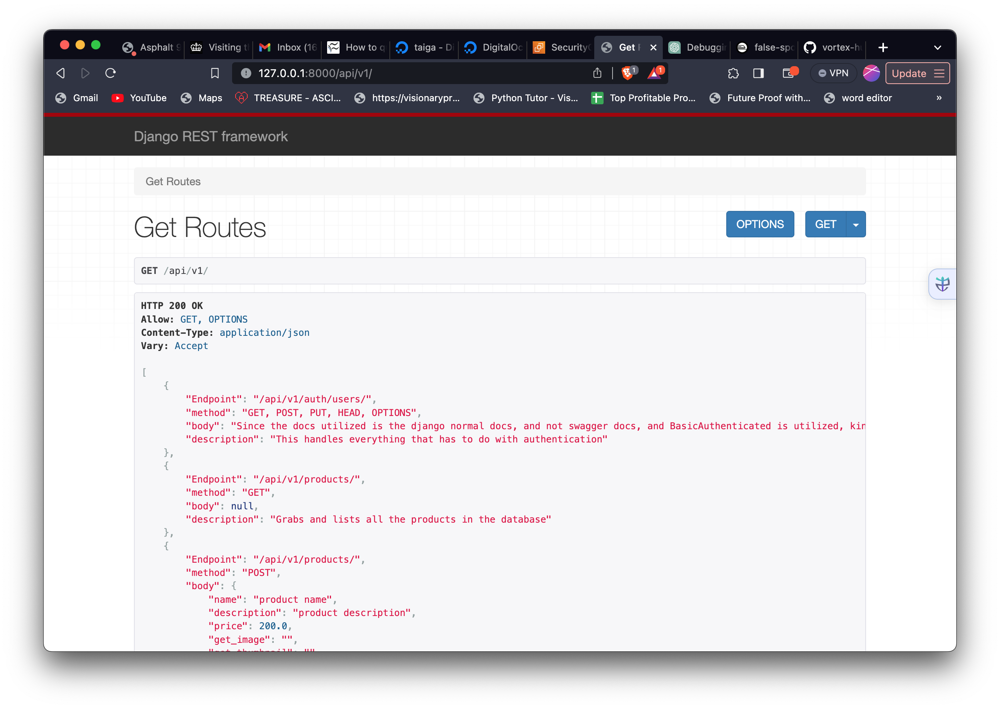

# Shoptreo E-commerce DRF API


Due to time constraint, the api backend built focused on products and orders management, for attention, i utilized `authentication.BasicAuthentication` why isn't the most secured for production, but to get things running asap, i created a default superuser for the authenticated sections of the software, the username is `admin` and password is `password`


## Maintenance 
The documentation is on the `/api/v1` endpoint,i didn't use swagger docs, because despite how old the DRF simple response docs are, i believe it's still one of the nicest out there

Below are the steps to run the project locally, but you can visit the live one on the url `shoptreo.up.railway.app/api/v1`

- Clone the github repo
```
git clone https://github.com/vortex-hue/shoptreo.git
```
- cd shoptreo

- activate a virtual env

```
python3 -m venv env && source env/bin/activate
```

- install the requirements

```
pip install -r requirements.txt
```

- run the project locally
```
chmod 755 manage.py && ./manage.py runserver 8008
```

- visit your localhost url
  ```
  http://127.0.0.1:8000/api/v1
  ```
